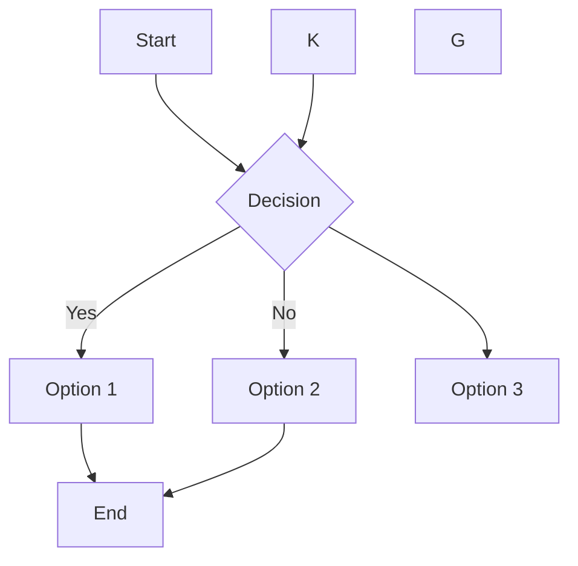

# iqra
My personal study roadmap

```mermaid
graph TD;
    A[Start] --> B{Decision};
    B -->|Yes| C[Option 1];
    B -->|No| D[Option 2];
    B --> F[Option 3];
    C --> E[End];
    D --> E[End];
    K --> B;

    G;
    
    click G href "./NeuralNetworks.md" "Go to Example"
```

[another Markdown file](./NeuralNetworks.md)