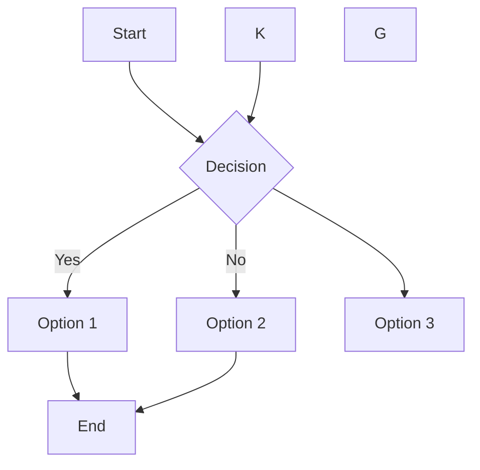

# iqra
My personal study roadmap

```mermaid
graph TD;
    A[Start] --> B{Decision};
    B -->|Yes| C[Option 1];
    B -->|No| D[Option 2];
    B --> F[Option 3];
    C --> E[End];
    D --> E[End];
    K --> B;

    G;
    
    click G "./#Topic";
```

asd
asdasdf
df
asdasdfsd

asdasdfasd
Fasdf
asdasdfsdf
df
asdasdfsdfasdf
asdasdf
df
asdasdfsdfasdf
sdf
adf

dfasfasd

## Topic 